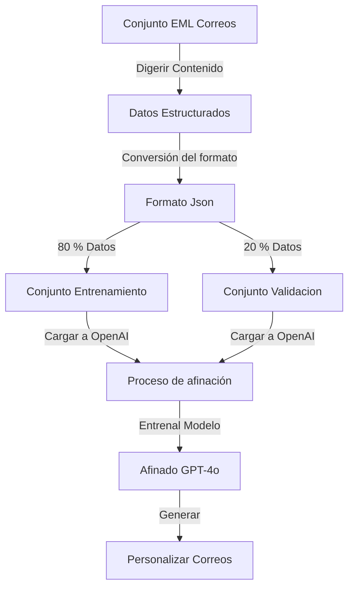

# ⚗️ Destilar Modo Correo AI
Procedimiento para sintetizar el modo de escritura del correo para generar un archivo de conocimiento para el agente de IA.

## Digrama del Concepto

```mermaid
graph TD
    A[Conjunto EML Correos] -->|Digerir Contenido| B[Datos Estructurados]
    B -->|Conversión del formato| C[Formato Json]
    C -->|80 % Datos| D[Conjunto Entrenamiento]
    C -->|20 % Datos| E[Conjunto Validacion]
    D -->|Cargar a OpenAI| F[Proceso de afinación]
    E -->|Cargar a OpenAI| F
    F -->|Entrenal Modelo| G[Afinado GPT-4o]
    G -->|Generar| H[Personalizar Correos]
```
