# ⚗️ Destilar Modo Correo AI
Procedimiento para sintetizar el modo de escritura del correo para generar un archivo de conocimiento para el agente de IA.

## Digrama del Concepto

```mermaid
graph TD
    A[Conjunto EML Correos] -->|Digerir Contenido| B[Datos Estructurados]
    B -->|Conversión del formato| C[Formato Json]
    C -->|80 % Datos| D[Conjunto Entrenamiento]
    C -->|20 % Datos| E[Conjunto Validacion]
    D -->|Cargar a OpenAI| F[Proceso de afinación]
    E -->|Cargar a OpenAI| F
    F -->|Entrenal Modelo| G[Afinado GPT-4o]
    G -->|Generar| H[Personalizar Correos]
```

## Revisión 🎯
- Personalizar la generación de correo es un estilo consistente.
- Mantener la marca de tono y toque personal.
- Manejar varios tipos de correos.
- facil de usar para una generación basada en prompts.
- Escalable para un alto volumen de comunicación via mail.

  ## Así funciona ⚙️

### 1. Procesamiento de datos
  Primero , se traslada los correos EML a un formato consistente. 
<!-- poner imagen del contenido del correo a un formato mas consistente. -->

### 2. Prompt para generación 
El sistema genera prompts que capturan la esencia de cada correo
<!-- Imagen de los prompt generados -->
### 3. Formateo datos
 Convertir datos al formato JSONL requerido por OpenAI
 <!--imagen del archivo procesado en JSONL -->

 ### 4. Proceso de Entrenamiento 
 

#### Proceso de carga del archivo
<!-- Procedimiento de caga del archivo --> 
#### Entrenar y probar IDs
<!-- Entrenamiento y prueba del archivo cargado a openAI --> 
#### Respuesta de afinacion 
<!-- La respuesta que da el proceso de afinacion con openAI -->
### 5. Rendimiento del modelo

El model afinado muestra resultado sorprendentes manteniendo el estilo y generación de contenido relevante.
<!-- La respuesta que da el proceso de afinacion con openAI -->

### 6. Resultados de las pruebas
#### Prompt basico para prueba

<!-- se manda el prompt básico para prueba -->
#### Prueba avanzada con diferentes parametros
<!-- Prueba de temperatura -->
## 💹 Caso de uso analisis de negocios
Este proyecto fue diseñado especialmente para un analista/maestro que necesitaenviar un correo personalizado a sus suscriptores. el modelo afinado les permite:
1. Mantener la consistencia de la marca de redacción.
2. Generar contenido que vincule rapidamente.
3. Personalizar la comunicación a escala.
4. Salva tiempo mientras mantienes calidad.

```mermaid
graph TD
    A[Analista de negocio] -->|Envia Prompt| B[Afinado con GPT-4o]
    B -->|Genera| C[Correo personalizado]
    C -->|Revisar y enviar| D[Subscriptores]
    D -->|Compromiso| E[Analiticos]
    E -->|Ciclo de retroalimentación| A
```

##🛠️ Implementación tecnica
El proyecto usa:
- OpenAI's GPT-4o model
- Python para el procesamiento de datos
- formato JSONL para entrenamiento de datos
- Sistema de prompts consistentes para el estilo
- 
